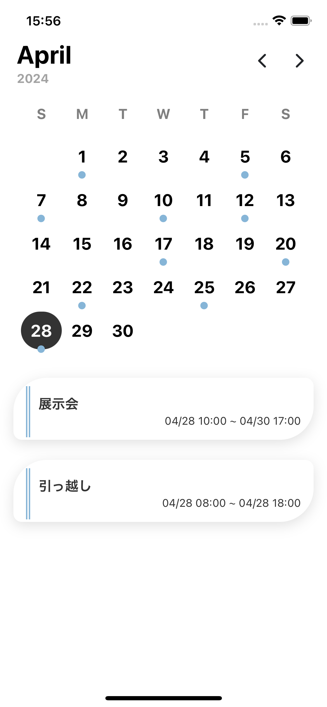

# custom-calendar-ui

## 概要

カレンダー UI です。
使用しているモジュールは

- date-fns

## 注意

date-fns をインストールした時
`Namespace 'Intl' has no exported member 'LocalesArgument'......`
というエラーが出る可能性があるので
tsconfig.json の`"lib":[<other lib>]`に`"ES2020.Intl"`を追記する。

## 見た目

