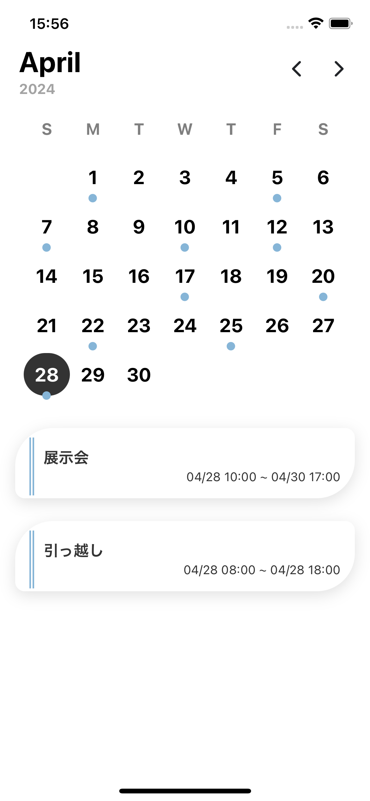

# custom-calendar-ui

## 概要

custom-calendar-UIです。

## 使い方

ts ファイル

```ts
import { MzkmnkCalendarComponent } from "mzkmnk-calendar";
```

html ファイル

```html
<ion-content>
  <mzkmnk-calendar [data]="<data>"></mzkmnk-calendar>
</ion-content>
```

## 注意

date-fns をインストールした時
`Namespace 'Intl' has no exported member 'LocalesArgument'......`
というエラーが出る可能性があるので
tsconfig.json の`"lib":[<other lib>]`に`"ES2020.Intl"`を追記する。

## 見た目


